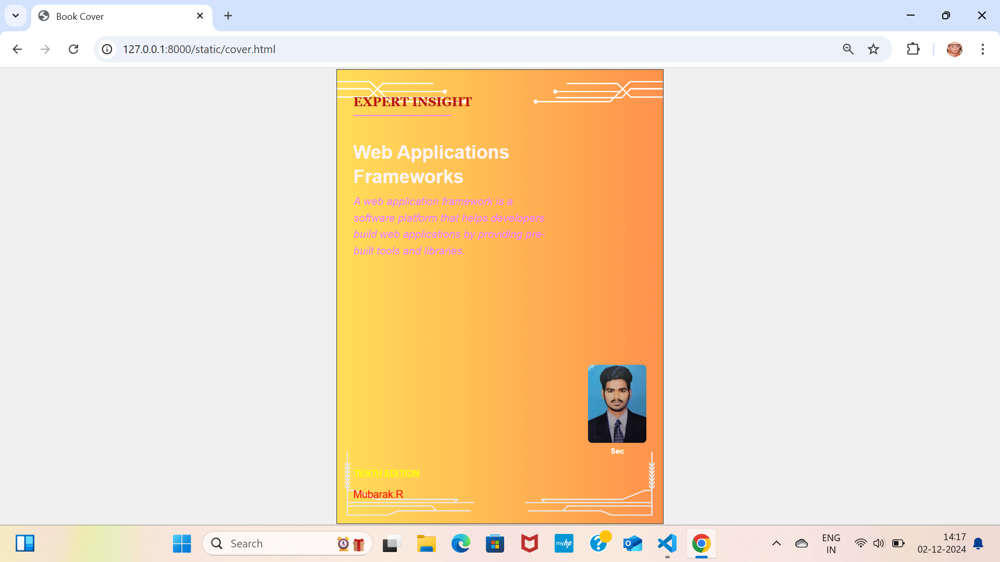

# Ex.06 Book Front Cover Page Design
## Date:2-12-24

## AIM:
To design a book front cover page using HTML and CSS.

## DESIGN STEPS:

### Step 1:
Create a Django Admin project.

### Step 2:
Create an app in the Django interface.

### Step 3:
Create a folder named 'static' in the app folder.

### Step 4:
Create a new HTML file in the static folder.

### Step 5:
Write the HTML code with relevant CSS properties.

### Step 6:
Choose the appropriate style and color scheme.

### Step 7:
Insert the images in their appropriate places.

### Step 8:
Publish the website in the LocalHost.

## PROGRAM:
```
<!DOCTYPE html>
<html lang="en">
<head>
    <meta charset="UTF-8">
    <meta name="viewport" content="width=device-width, initial-scale=1.0">
    <title>Book Cover</title>
    <style>
        body {
            margin: 0;
            font-family: Arial, sans-serif;
            display: flex;
            justify-content: center;
            align-items: center;
            min-height: 100vh;
            background-color: #f0f0f0;
        }

        .background-container {
            width: 210mm;
            height: 297mm;
            background-color: #fff;
            background-image: url('mubarak.png');
            background-repeat: no-repeat;
            background-position: center;
            background-size: cover;
            position: relative;
            padding: 20px;
            border: 2px solid #333;
        }

        .text-container {
            position: absolute;
            top: 5%; 
            left: 5%;
            color: #fcf4f4;
            z-index: 10;
            font-size: 24px;
            line-height: 1.5;
            width: 60%; 
        }

        .expert-insight {
            font-size: 32px;
            font-weight: bold;
            color: rgb(186, 12, 12);
            font-family: 'Georgia', serif;
            margin-bottom: 10px;
        }

        .book-title {
            font-size: 48px;
            font-weight: bold;
            line-height: 1.3;
        }

        .subtitle {
            font-size: 28px;
            font-style: italic;
            font-weight: 300;
            color: violet;
            margin-top: 10px;
        }

        .edition {
            font-size: 22px;
            font-weight: bold;
            color:yellow;
            text-decoration: underline;
            position: absolute;
            bottom: 10%;
            left: 5%;
        }

        .author-name {
            position: absolute;
            bottom: 5%;
            left: 5%;
            font-size: 26px;
            font-weight: 300;
            color: red; 
        }

        .line {
            width: 50%; 
            border-top: 3px solid violet; 
            margin-top: 10px;
        }

        .image-container {
            position: absolute;
            bottom: 15%;
            right: 5%;
            text-align: center; 
        }

        .image-container img {
            width: 150px;
            height: 200px;
            border-radius: 10px;
            object-fit: cover;
        }

        .sec-label {
            font-size: 20px;
            font-weight: bold;
            color: white;
            margin-top: 5px; 
        }

    </style>
</head>
<body>

<div class="background-container">
    <div class="text-container">
        <div class="expert-insight">
            EXPERT INSIGHT
        </div>
        <div class="line"></div> 
        <div class="book-title">
          <br> Web Applications Frameworks</br>
        </div>
        <div class="subtitle">
            A web application framework is a software platform that helps developers build web applications by providing pre-built tools and libraries. 
        </div>
    </div>

    <div class="edition">
        TENTH EDITION 
    </div>

    <div class="author-name">
        Mubarak.R
    </div>

    <div class="image-container">
        
        <div class="sec-label">Sec</div>
    </div>
</div>

</body>
</html>
```


## OUTPUT:


## RESULT:
The program for designing book front cover page using HTML and CSS is completed successfully.
